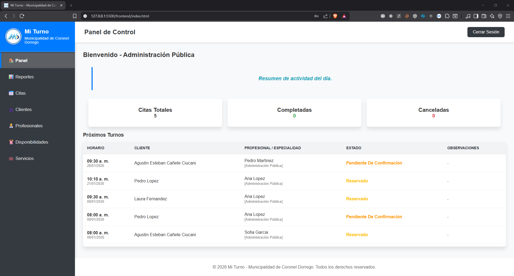
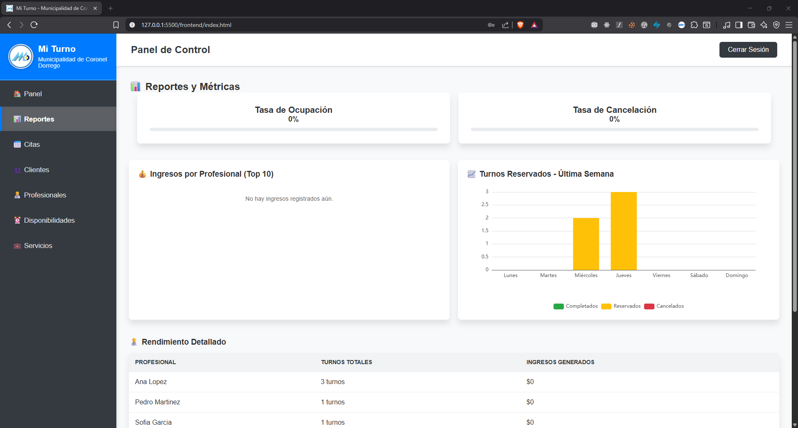
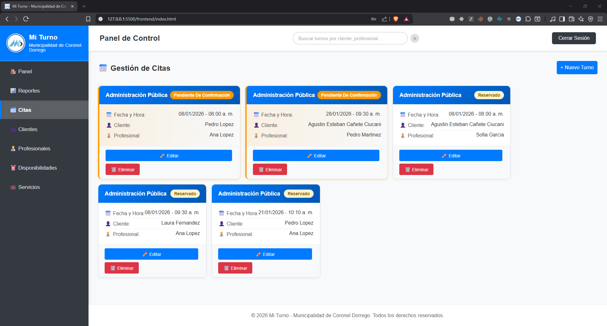
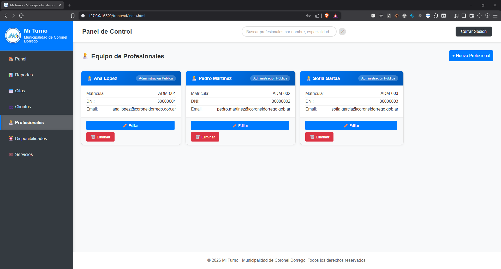
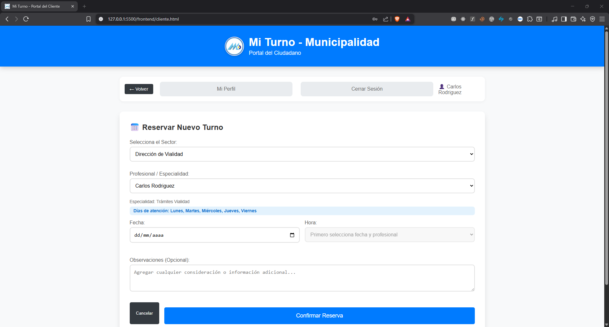
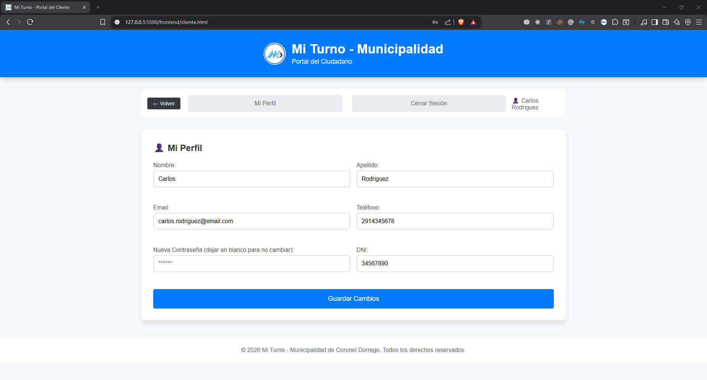

# 🏥 Sistema de Gestión de Turnos - Municipalidad

Bienvenido al sistema de gestión de turnos. Esta aplicación permite administrar citas, clientes, profesionales y disponibilidades para distintos sectores municipales.

---

## 📸 Galería del Proyecto

El sistema cuenta con dos módulos principales: **Panel Administrativo** (para gestión interna) y **Portal del Ciudadano** (para reserva de turnos).

### 📊 Panel de Administración
| Dashboard General | Reportes y Métricas |
|:---:|:---:|
|  |  |
| *Vista general de actividad diaria* | *Análisis de ocupación y servicios* |

| Gestión de Citas | Administración de Profesionales |
|:---:|:---:|
|  |  |
| *Control de estados y asignaciones* | *Gestión de equipo médico* |

### 👤 Portal del Ciudadano
| Reserva de Turno | Perfil del Usuario |
|:---:|:---:|
|  |  |
| *Interfaz de auto-gestión de citas* | *Historial de turnos del paciente* |

---

## 🚀 Guía Rápida de Instalación y Despliegue

Estos son los pasos para poner en marcha el proyecto en tu máquina local.

### 1. Requisitos Previos
- **Python 3.10** o superior.
- **MySQL Server** (8.0 recomendado).
- **Git** (opcional, para clonar).

### 2. Configuración del Entorno (Backend)

Abrir una terminal en la carpeta principal del proyecto (`turnosApp`) y ejecutar:

**Windows (PowerShell):**
```powershell
# 1. Crear entorno virtual
python -m venv .venv

# 2. Activar entorno
.\.venv\Scripts\Activate

# 3. Instalar dependencias
pip install -r requirements.txt
```

**Linux/Mac:**
```bash
python3 -m venv .venv
source .venv/bin/activate
pip install -r requirements.txt
```

### 3. Configuración de Base de Datos

1. Asegúrate de tener MySQL corriendo.
2. Crea un archivo `.env` en `backend/` basado en el ejemplo:
   ```bash
   cp backend/.env.example backend/.env
   ```
3. Edita `backend/.env` con tus credenciales de base de datos (`DB_USER`, `DB_PASSWORD`).

**Inicializar Base de Datos:**
Puedes usar MySQL Workbench o la línea de comandos:

```bash
# Desde la raíz del proyecto
mysql -u root -p < database/01_INSTALL.sql
mysql -u root -p < database/02_SEED_MUNI.sql
```
*(El primer script crea la estructura, el segundo carga datos de prueba)*.

### 4. Ejecutar la Aplicación

Con el entorno virtual activado:

```powershell
# Desde la carpeta raíz
python backend/main.py
```

El servidor iniciará en: `http://127.0.0.1:5000`

---

## 📂 Estructura del Proyecto

La documentación detallada se encuentra en la carpeta `documentacion/`:

- **[📖 Guía de Base de Datos](documentacion/DATABASE.md)**: Explicación de tablas y scripts.
- **[🔌 Documentación de API](documentacion/API.md)**: Endpoints del Backend (Flask).
- **[💻 Guía Frontend](documentacion/FRONTEND.md)**: Estructura del cliente web y módulos JS.
- **[🧪 Testing](documentacion/TESTING.md)**: Cómo ejecutar las pruebas automatizadas.

---

## 🛠️ Tecnologías

<div align="left">

  
  
  
  
  
  <br/>
  
  
  
  
  

</div>

---

## 👥 Soporte

Si encuentras problemas durante la instalación, revisa que el servicio de MySQL esté corriendo y que las credenciales en `.env` sean correctas.